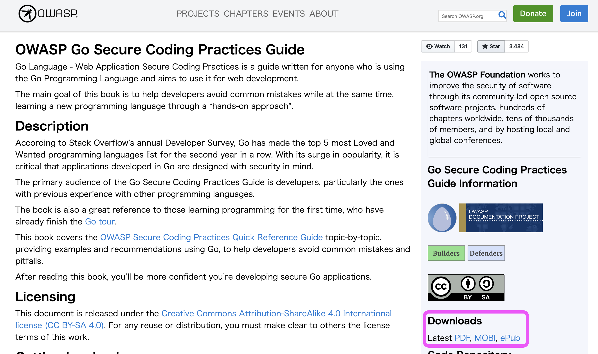

Go language has become a popular language in the world today. Many famous open-source products use Golang. Today I will introduce simple tips on how to create a secure project in Golang.

Beforehand. I would like to recommend reading [OWASP(Open Web Application Security Project)'s Secure Coding Plactice](https://owasp.org/www-project-go-secure-coding-practices-guide/) even if your application is not a web application. It is one of the best books on secure coding in Golang. Today, I will talk about tips not included in OWASP Go guidelines.

---



# Secret data management

We should not keep secret/credential data in code and repositories. For example, AWS tokens, database password and so on. I always pass secret data from environment variables or configuration files and add these files to .gitignore.

## Pass via environment variables

I always create environments with Docker. I always use [caarlos0/env](https://github.com/caarlos0/env). However, if you do not want to use an external library and your value types are simple, you can load via the following function.

```bash
package main

import (
	"fmt"
	"log"
	"os"
)

func main() {
	username := GetEnvWithDefault("username", "root")
	passwd := GetEnvWithDefault("passwd", "", true)
	fmt.Println(username, passwd)
}

func GetEnvWithDefault(name, defaultValue string, required ...bool) string {
	if value, ok := os.LookupEnv(name); ok {
		return value
	}
	if len(required) > 0 && required[0] {
		log.Fatal(name + " is required but not found.")
	}
	return defaultValue
}
```

## Pass via configuration file

You can load secret values from configuration files. 

[spf13/viper](https://github.com/spf13/viper) is the most popular library. It can adapt to any situation but it contains many dependencies. So I recommend using [jinzhu/configor](https://github.com/jinzhu/configor) if you want to keep projects simple. This package is only dependant on the [gopkg.in/yaml](https://gopkg.in/yaml.v2) and [BurntSushi/toml](https://github.com/BurntSushi/toml) libraries.

Many types of container orchestration tools have options that can set secret data as filetypes.

e.g. Kubernetes

```bash
# create a secret data resource
$ kubectl create secret generic production-config --from-file=./config.toml
```

```bash
# pod definition
apiVersion: v1
kind: Pod
metadata:
  name: golang-with-secret-config
spec:
  containers:
    - name: golang-app
      image: your-golang-container
      volumeMounts:
        # name must match the volume name below
        - name: config-volume
          mountPath: /path/to/binary-root
  volumes:
    - name: config-volume
      secret:
        secretName: production-config
```

# Path traversal

We should pay attention when managing file paths. A relative path will cause path traversal. 

Here is a path traversal definition refer to [OWASP](https://owasp.org/www-community/attacks/Path_Traversal).

> A path traversal attack (also known as directory traversal) aims to access files and directories that are stored outside the web root folder. By manipulating variables that reference files with “dot-dot-slash (../)” sequences and its variations or by using absolute file paths, it may be possible to access arbitrary files and directories stored on file system including application source code or configuration and critical system files. It should be noted that access to files is limited by system operational access control (such as in the case of locked or in-use files on the Microsoft Windows operating system).

[opencontainers/runc](https://github.com/opencontainers/runc) does not allow setting upper-level directories (except absolute paths). It prevents users from controlling important file data.

[https://github.com/opencontainers/runc/blob/master/libcontainer/utils/utils.go#L47-L74](https://github.com/opencontainers/runc/blob/master/libcontainer/utils/utils.go#L47-L74)

```bash
// CleanPath makes a path safe for use with filepath.Join. This is done by not
// only cleaning the path, but also (if the path is relative) adding a leading
// '/' and cleaning it (then removing the leading '/'). This ensures that a
// path resulting from prepending another path will always resolve to lexically
// be a subdirectory of the prefixed path. This is all done lexically, so paths
// that include symlinks won't be safe as a result of using CleanPath.
func CleanPath(path string) string {
	// Deal with empty strings nicely.
	if path == "" {
		return ""
	}

	// Ensure that all paths are cleaned (especially problematic ones like
	// "/../../../../../" which can cause lots of issues).
	path = filepath.Clean(path)

	// If the path isn't absolute, we need to do more processing to fix paths
	// such as "../../../../<etc>/some/path". We also shouldn't convert absolute
	// paths to relative ones.
	if !filepath.IsAbs(path) {
		path = filepath.Clean(string(os.PathSeparator) + path)
		// This can't fail, as (by definition) all paths are relative to root.
		path, _ = filepath.Rel(string(os.PathSeparator), path)
	}

	// Clean the path again for good measure.
	return filepath.Clean(path)
}
```

# And more...

I hope you found this article interesting and please let me know via twitter if you have any thoughts or tips.
