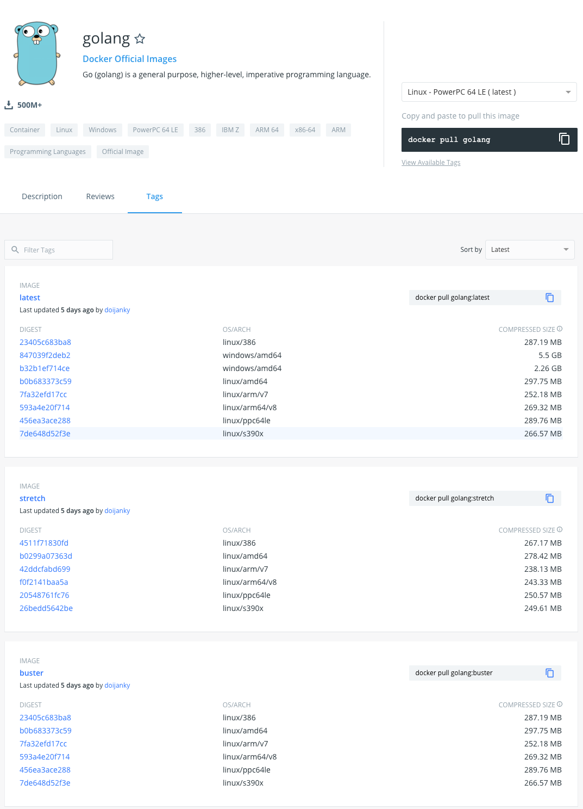

I created an open-source tool, [Dockertags](https://github.com/goodwithtech/dockertags). This tool is very easy to use. You only need to run `dockertags imageName`. [Dockertags](https://github.com/goodwithtech/dockertags) shows what tags exist in a remote image registry. [Dockertags](https://github.com/goodwithtech/dockertags) works in multiple registries, it currently supports Docker Hub, GCR, and ECR. Here are some sample commands and outputs. 

---

```bash
$ dockertags golang
+--------------------------------+--------------------------------+--------------------------------+--------------------------------+------------+----------------------+
|              TAG               |              SIZE              |             DIGEST             |            OS/ARCH             | CREATED AT |     UPLOADED AT      |
+--------------------------------+--------------------------------+--------------------------------+--------------------------------+------------+----------------------+
| stretch                        | 243.3M                         | f0f2141baa5a                   | linux/arm64/v8                 | NULL       | 2020-04-01T02:25:44Z |
| 1.14-stretch                   | 278.4M                         | b0299a07363d                   | linux/amd64                    |            |                      |
| 1.14.1-stretch                 | 250.6M                         | 20548761fc76                   | linux/ppc64le                  |            |                      |
|                                | 267.2M                         | 4511f71830fd                   | linux/386                      |            |                      |
|                                | 238.1M                         | 42ddcfabd699                   | linux/arm/v7                   |            |                      |
|                                | 249.6M                         | 26bedd5642be                   | linux/s390x                    |            |                      |
+--------------------------------+--------------------------------+--------------------------------+--------------------------------+------------+----------------------+
| 1.14                           | 5.5G                           | 847039f2deb2                   | windows/amd64                  | NULL       | 2020-04-01T02:25:37Z |
| latest                         | 2.3G                           | b32b1ef714ce                   | windows/amd64                  |            |                      |
| 1.14.1                         |                                |                                |                                |            |                      |
+--------------------------------+--------------------------------+--------------------------------+--------------------------------+------------+----------------------+
| 1.14                           | 287.2M                         | 23405c683ba8                   | linux/386                      | NULL       | 2020-04-01T02:25:37Z |
| latest                         | 266.6M                         | 7de648d52f3e                   | linux/s390x                    |            |                      |
| buster                         | 252.2M                         | 7fa32efd17cc                   | linux/arm/v7                   |            |                      |
| 1.14.1                         | 269.3M                         | 593a4e20f714                   | linux/arm64/v8                 |            |                      |
| 1.14-buster                    | 297.8M                         | b0b683373c59                   | linux/amd64                    |            |                      |
| 1.14.1-buster                  | 289.8M                         | 456ea3ace288                   | linux/ppc64le                  |            |                      |
+--------------------------------+--------------------------------+--------------------------------+--------------------------------+------------+----------------------+
| 1.13.9-stretch                 | 246.7M                         | 1332e217ccd7                   | linux/s390x                    | NULL       | 2020-04-01T02:24:48Z |
|                                | 263.9M                         | dec20872e781                   | linux/386                      |            |                      |
|                                | 234.9M                         | a4d66c612441                   | linux/arm/v7                   |            |                      |
|                                | 275.1M                         | 6c304de0387a                   | linux/amd64                    |            |                      |
|                                | 240.2M                         | 2feca85d0acc                   | linux/arm64/v8                 |            |                      |
|                                | 247.4M                         | 265137cbe89d                   | linux/ppc64le                  |            |                      |
+--------------------------------+--------------------------------+--------------------------------+--------------------------------+------------+----------------------+

# dockertags get first 10 tags in default. You need to add `limit` flag, like `--limit 0`.
```

You can see following points in this result.

- These images were uploaded on April 1st at almost the same time (maybe using a scheduled task)
- golang:latest's go version tag is `1.14.1` which is the same as the `1.14` tag (because of latest version listed in the same box as 1.14 and  1.14.1 in the `TAG` field)
- golang:latest is based on Debian Buster in the Linux OS
- golant:latest image size is over 5GB in the Windows OS

Maybe it is difficult to see in a Docker Hub's tag page. You cannot see what Go version is in the latest image on the following page:



But you need some knowledge of docker images if you want to use Dockertags efficiently. For example, what are tags, what is an OS/ARCH on Docker, and what is an image digest. Today I will explain that.

# Docker images

First I will explain what docker images are.

## result of `docker images`

```bash
$ docker images --filter=reference="alpine"
REPOSITORY          TAG                 IMAGE ID            CREATED             SIZE
alpine              3.9                 82f67be598eb        2 months ago        5.53MB
alpine              3.11                e7d92cdc71fe        2 months ago        5.59MB
alpine              latest              e7d92cdc71fe        2 months ago        5.59MB
```

The results indicate the following points:

- the alpine:3.11 is the same as the alpine:latest and the alpine:3.9 image is not the same as the others
- These images maybe old
In this situation, you will build on an old image if you write the following command:

```bash
$ docker build -t myimage:latest -<<EOF
FROM alpine:latest
RUN echo "hello" > /sayhello.txt
ENTRYPOINT ["cat", "/sayhello.txt"]
EOF

$ docker run --rm myimage:latest
hello
```

If you want to build on a newer version image, you need to remove the current image with `docker rmi imageName` . You can see the alpine:latest image changes IMAGE ID, CREATED, and SIZE.

```bash
$ docker rmi alpine:latest
Untagged: alpine:latest
$ docker pull alpine:latest
latest: Pulling from library/alpine
aad63a933944: Already exists
Digest: sha256:b276d875eeed9c7d3f1cfa7edb06b22ed22b14219a7d67c52c56612330348239
Status: Downloaded newer image for alpine:latest
docker.io/library/alpine:latest

$ docker images --filter=reference="alpine"
REPOSITORY          TAG                 IMAGE ID            CREATED             SIZE
alpine              latest              a187dde48cd2        7 days ago          5.6MB
alpine              3.9                 82f67be598eb        2 months ago        5.53MB
alpine              3.11                e7d92cdc71fe        2 months ago        5.59MB
```

- You can see this because the 3.11 image and the latest image have the same IMAGE ID and the 3.9 doesn't.
- You can see this because these were CREATED two months ago

Wrap-up of this section: 

- Local docker images may be old until the image is updated
- images are built based on a local docker images if they are old

# Prerequisite: Get container images with digests

## Docker manifests

> The *manifest types* are effectively the JSON-represented description of a named/tagged image. This description (manifest) is meant for consumption by a container runtime, like the Docker engine.

[https://stackoverflow.com/questions/47006220/what-is-a-container-manifest](https://stackoverflow.com/questions/47006220/what-is-a-container-manifest)

## Docker digests

A manifest has a unique image digest. You can check image digests with the `--digests` option.

```bash
docker images --digests --filter=reference="alpine"
REPOSITORY          TAG                 DIGEST                                                                    IMAGE ID            CREATED             SIZE
alpine              latest              sha256:b276d875eeed9c7d3f1cfa7edb06b22ed22b14219a7d67c52c56612330348239   a187dde48cd2        11 days ago         5.6MB
alpine              3.9                 sha256:115731bab0862031b44766733890091c17924f9b7781b79997f5f163be262178   82f67be598eb        2 months ago        5.53MB
alpine              3.11                sha256:ab00606a42621fb68f2ed6ad3c88be54397f981a7b70a79db3d1172b11c4367d   e7d92cdc71fe        2 months ago        5.59MB
```

You can pull and run target container images with digests. It is not good for readability but you can get an immutable image. 

[https://success.docker.com/article/images-tagging-vs-digests#pinningbydigest](https://success.docker.com/article/images-tagging-vs-digests#pinningbydigest)

[https://docs.docker.com/engine/reference/commandline/pull/#pull-an-image-by-digest-immutable-identifier](https://docs.docker.com/engine/reference/commandline/pull/#pull-an-image-by-digest-immutable-identifier)

```bash
$ docker run --rm hello-world@sha256:468a2702c410d84e275ed28dd0f46353d57d5a17f177aa7c27c2921e9ef9cd0e
Unable to find image 'hello-world@sha256:468a2702c410d84e275ed28dd0f46353d57d5a17f177aa7c27c2921e9ef9cd0e' locally
sha256:468a2702c410d84e275ed28dd0f46353d57d5a17f177aa7c27c2921e9ef9cd0e: Pulling from library/hello-world
8e709836e4dc: Pulling fs layer
543ff0f9573f: Downloading [==============>                                    ]     472B/1.652kB
f01167dd6121: Downloading [========================>                          ]     473B/959B
docker: image operating system "windows" cannot be used on this platform.
See 'docker run --help'.
```

# What is a OS/ARCH on Docker images

Docker images have information an image is able to run on different platforms (OS, hardware architectures). We can set the same tag if these images are not using the same platform.

[https://callistaenterprise.se/blogg/teknik/2017/12/28/multi-platform-docker-images/](https://callistaenterprise.se/blogg/teknik/2017/12/28/multi-platform-docker-images/)

The above linked article describes how to create a Docker image that works on different hardware architectures and operating systems.

You can check information in a manifest file:

```bash
$ docker manifest inspect hello-world:latest
{
   "schemaVersion": 2,
   "mediaType": "application/vnd.docker.distribution.manifest.list.v2+json",
   "manifests": [
      {
         "mediaType": "application/vnd.docker.distribution.manifest.v2+json",
         "size": 524,
         "digest": "sha256:92c7f9c92844bbbb5d0a101b22f7c2a7949e40f8ea90c8b3bc396879d95e899a",
         "platform": {
            "architecture": "amd64",
            "os": "linux"
         }
      },
      ...
      {
         "mediaType": "application/vnd.docker.distribution.manifest.v2+json",
         "size": 525,
         "digest": "sha256:8aaea2a718a29334caeaf225716284ce29dc17418edba98dbe6dafea5afcda16",
         "platform": {
            "architecture": "ppc64le",
            "os": "linux"
         }
      },
      {
         "mediaType": "application/vnd.docker.distribution.manifest.v2+json",
         "size": 525,
         "digest": "sha256:577ad4331d4fac91807308da99ecc107dcc6b2254bc4c7166325fd01113bea2a",
         "platform": {
            "architecture": "s390x",
            "os": "linux"
         }
      },
      {
         "mediaType": "application/vnd.docker.distribution.manifest.v2+json",
         "size": 1124,
         "digest": "sha256:468a2702c410d84e275ed28dd0f46353d57d5a17f177aa7c27c2921e9ef9cd0e",
         "platform": {
            "architecture": "amd64",
            "os": "windows",
            "os.version": "10.0.17763.1098"
         }
      }
   ]
}
```

You can see the tagged image has some manifests. 

Let's try to run these images with digests.

```bash
# run "Linux", "amd64"
$ docker run --rm hello-world@sha256:92c7f9c92844bbbb5d0a101b22f7c2a7949e40f8ea90c8b3bc396879d95e899a
Unable to find image 'hello-world@sha256:92c7f9c92844bbbb5d0a101b22f7c2a7949e40f8ea90c8b3bc396879d95e899a' locally
sha256:92c7f9c92844bbbb5d0a101b22f7c2a7949e40f8ea90c8b3bc396879d95e899a: Pulling from library/hello-world
256ab8fe8778: Pull complete
Digest: sha256:92c7f9c92844bbbb5d0a101b22f7c2a7949e40f8ea90c8b3bc396879d95e899a
Status: Downloaded newer image for hello-world@sha256:92c7f9c92844bbbb5d0a101b22f7c2a7949e40f8ea90c8b3bc396879d95e899a

Hello from Docker!
This message shows that your installation appears to be working correctly.

To generate this message, Docker took the following steps:
 1. The Docker client contacted the Docker daemon.
 2. The Docker daemon pulled the "hello-world" image from the Docker Hub.
    (arm64v8)
 3. The Docker daemon created a new container from that image which runs the
    executable that produces the output you are currently reading.
 4. The Docker daemon streamed that output to the Docker client, which sent it
    to your terminal.

To try something more ambitious, you can run an Ubuntu container with:
 $ docker run -it ubuntu bash

Share images, automate workflows, and more with a free Docker ID:
 https://hub.docker.com/

For more examples and ideas, visit:
 https://docs.docker.com/get-started/

# run "windows", "amd64"
$ docker run --rm hello-world@sha256:468a2702c410d84e275ed28dd0f46353d57d5a17f177aa7c27c2921e9ef9cd0e
Unable to find image 'hello-world@sha256:468a2702c410d84e275ed28dd0f46353d57d5a17f177aa7c27c2921e9ef9cd0e' locally
sha256:468a2702c410d84e275ed28dd0f46353d57d5a17f177aa7c27c2921e9ef9cd0e: Pulling from library/hello-world
8e709836e4dc: Pulling fs layer
543ff0f9573f: Downloading [==============>                                    ]     472B/1.652kB
f01167dd6121: Downloading [========================>                          ]     473B/959B
docker: image operating system "windows" cannot be used on this platform.
```

Running the Windows OS image failed on MacOS, giving  the following error message:

 `docker: image operating system "windows" cannot be used on this platform.`

A wrap-up of this section:

- Tagged images are aliases for target images with digests
- Images only run correct platform (OS, hardware architecture)
- os/arch is set in the manifest
# [Dockertags](https://github.com/goodwithtech/dockertags)

There are most of the things you need to know about docker images. Dockertags makes it easy to check these attributes and summarize in TAG and OS/ARCH.

The next example shows the final result of what was described this article.

The `hello-world` image tags are very weird, but now you can understand the following results' meanings:

```bash
$ dockertags -l 0 hello-world
+--------------------------------+--------------------------------+--------------------------------+--------------------------------+------------+----------------------+
|              TAG               |              SIZE              |             DIGEST             |            OS/ARCH             | CREATED AT |     UPLOADED AT      |
+--------------------------------+--------------------------------+--------------------------------+--------------------------------+------------+----------------------+
| latest                         | 96.4M                          | 468a2702c410                   | windows/amd64                  | NULL       | 2020-03-11T13:41:36Z |
| nanoserver                     |                                |                                |                                |            |                      |
| nanoserver-1809                |                                |                                |                                |            |                      |
+--------------------------------+--------------------------------+--------------------------------+--------------------------------+------------+----------------------+
| latest                         | 304.8K                         | 85dc5fbe1621                   | linux/386                      | NULL       | 2020-03-11T13:41:20Z |
|                                | 1.3K                           | 8aaea2a718a2                   | linux/ppc64le                  |            |                      |
|                                | 977B                           | 92c7f9c92844                   | linux/amd64                    |            |                      |
|                                | 1.1K                           | 577ad4331d4f                   | linux/s390x                    |            |                      |
+--------------------------------+--------------------------------+--------------------------------+--------------------------------+------------+----------------------+
| linux                          | 3.3K                           | 963612c5503f                   | linux/arm64                    | NULL       | 2020-03-11T13:41:20Z |
| latest                         | 3.6K                           | e5785cb0c62c                   | linux/arm                      |            |                      |
|                                | 3K                             | 50b8560ad574                   | linux/arm                      |            |                      |
+--------------------------------+--------------------------------+--------------------------------+--------------------------------+------------+----------------------+
| linux                          | 2.7K                           | ebf526c198a1                   | linux/386                      | NULL       | 2020-01-03T02:41:49Z |
|                                | 3.2K                           | e49abad529e5                   | linux/s390x                    |            |                      |
|                                | 2.5K                           | 90659bf80b44                   | linux/amd64                    |            |                      |
|                                | 3.9K                           | bb7ab0fa94fd                   | linux/ppc64le                  |            |                      |
+--------------------------------+--------------------------------+--------------------------------+--------------------------------+------------+----------------------+
| nanoserver-1803                | 146.1M                         | 4420cea78cd6                   | windows/amd64                  | NULL       | 2019-11-20T14:41:37Z |
+--------------------------------+--------------------------------+--------------------------------+--------------------------------+------------+----------------------+
| nanoserver-1709                | 132.2M                         | dca7ef8e4f3a                   | windows/amd64                  | NULL       | 2019-04-12T05:43:34Z |
+--------------------------------+--------------------------------+--------------------------------+--------------------------------+------------+----------------------+
| nanoserver-sac2016             | 415.2M                         | 2c911f8d79db                   | windows/amd64                  | NULL       | 2019-01-01T10:43:20Z |
+--------------------------------+--------------------------------+--------------------------------+--------------------------------+------------+----------------------+
| nanoserver1709                 | 94.5M                          | eb6bb16eb0d9                   | windows/amd64                  | NULL       | 2017-11-21T05:43:32Z |
+--------------------------------+--------------------------------+--------------------------------+--------------------------------+------------+----------------------+
```

You can see:

- The pulled container image will change depending on your environment if you are using the `latest` tag
- Windows OS names use `nanoserver-xxx`
- Windows OS images are very big
- Some of the latest linux images are not named linux and images tagged linux/arm have not been changed in three months

Dockertags has some additional features. Here are the dockertags options.

```bash
  --limit value, -l value        set max tags count. if exist no tag image will be short numbers. limit=0 means fetch all tags (default: 10)
  --contain value, -c value      contains target string. multiple string allows.
  --format value, -f value       target format table or json, default table (default: "table")
  --output value, -o value       output file name, default output to stdout
  --authurl value, --auth value  GetURL when fetch authentication
  --timeout value, -t value      e.g)5s, 1m (default: 10s)
  --username value, -u value     Username
  --password value, -p value     Using -password via CLI is insecure. Be careful.
  --digests                      Show long digests
  --debug, -d                    Show debug logs
  --help, -h                     show help
  --version, -v                  print the version
```

I hope you enjoyed this article. I'm curious to hear any feedback you might have. ([Twitter](https://twitter.com/tomoyamachi) and [GitHub](https://github.com/goodwithtech/dockertags)).
